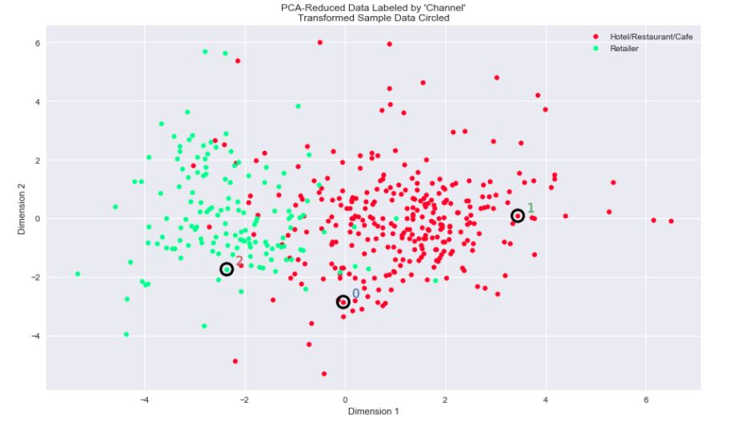
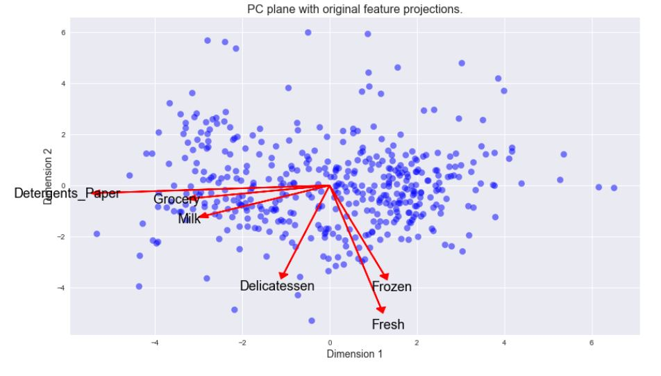
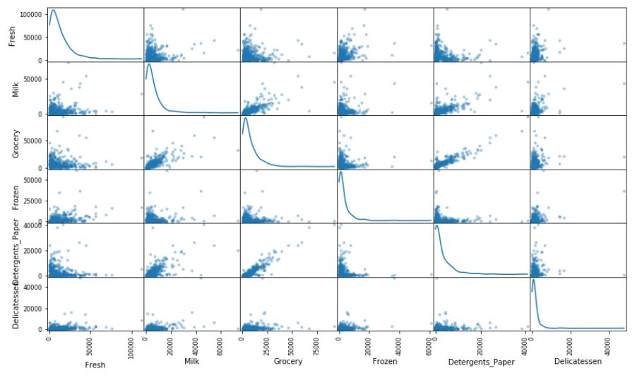
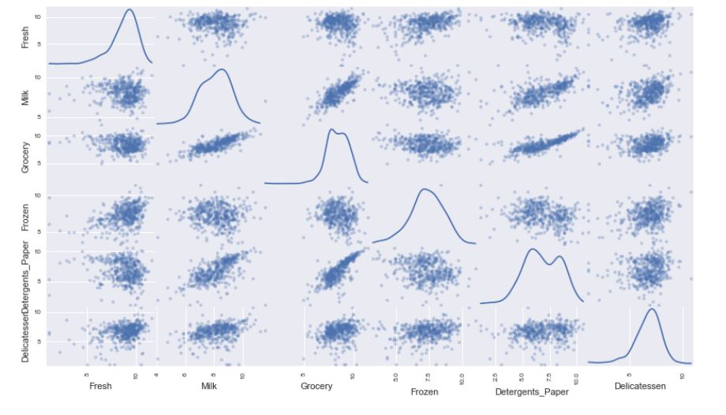

# Creating Customer Segments
Language: Python (scikit-learn, pandas, NumPy, matplotlib, seaborn)   
Skills: Machine Learning, Data Exploration, Data Visualization  

  

  

### Feature Scaling

  
   

